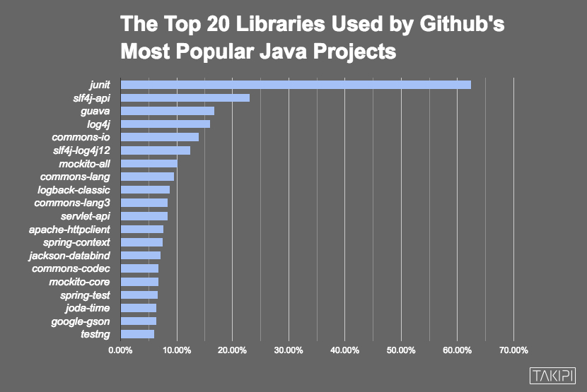
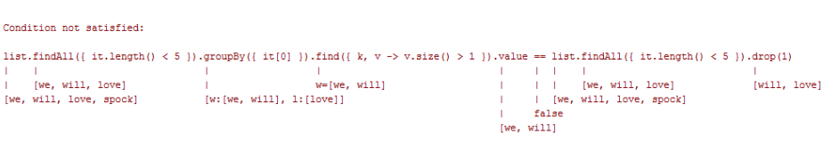
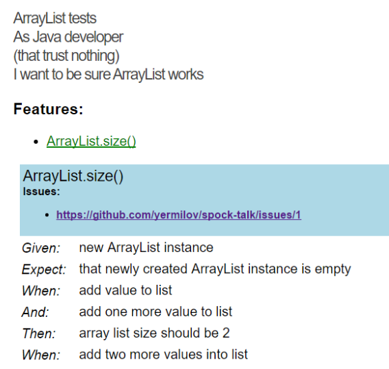
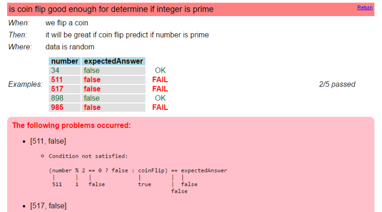
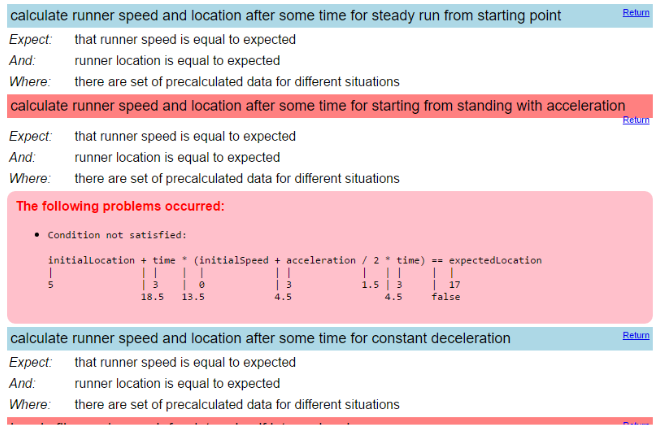
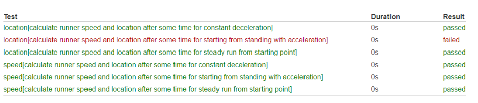
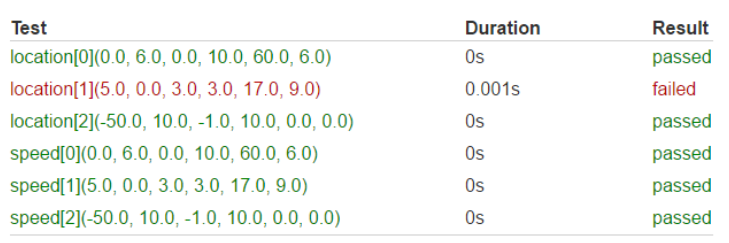

= What Mr. Spock would possibly say about modern unit testing: pragmatic and emotional overview
Yaroslav Yermilov <https://yermilov.github.io[icon:fa-rss[] blog, window="_blank"] https://github.com/yermilov[icon:github[] @yermilov, window="_blank"] https://www.facebook.com/yaroslav.yermilov[icon:facebook[] @yaroslav.yermilov, window="_blank"] https://twitter.com/yermilov17[icon:twitter[] @yermilov17, window="_blank"]>
2016-11-08
ifndef::sourcedir[:sourcedir: ../../]
:toc:
:icons: font
:linkattrs:
:source-highlighter: coderay

== Introduction

In this article we will try to examine current state of the automated testing concept in the Java world.
As a reference, we will go through basic and advanced spock-framework features and compare them with what JUnit4/JUnit5/TestNG/Hamcrest/AssertJ/Mockito/whatever can offer instead.
We will try to understand Spock philosophy and find out both pragmatic and emotional answer to the questions:
should I use spock-framework in the year of 2016?
how to convince my manager that "yes, we should"?
how to convince my teammates that "no, we shouldn't"?

All sources from examples can be found link:https://github.com/yermilov/spock-talk[here, window="_blank"].

== What's About Modern Unit Testing?

To my mind, automated testing is one of the most powerful software development concept suggested so far.
After receiving great attention as part of XP manifesto, it made possible to increase size of projects and complexity of code we are able to maintain by orders of magnitude.

link:http://junit.org/[JUnit, window="_blank"], started by Kent Beck and Erich Gamma, played key role in the development of the automated testing idea as it was one of the first ever and surely the most popular and influential automated testing library.

link:http://testng.org/[TestNG, window="_blank"], started by Cédric Beust, was inspired by JUnit and initiated to offer wider and more powerful range of functionalities than JUnit originally does, keeping the same general concept. Later, most of the TestNG initiatives were implemented by JUnit.

As link:http://blog.takipi.com/the-top-100-java-libraries-in-2016-after-analyzing-47251-dependencies/[recent study, window="_blank"] shows, JUnit is used by about amazingly 60% of Java projects and TestNG shows quite strong result of about 6%.

.Source: link:http://blog.takipi.com/the-top-100-java-libraries-in-2016-after-analyzing-47251-dependencies/[http://blog.takipi.com/the-top-100-java-libraries-in-2016-after-analyzing-47251-dependencies/, window="_blank"]

Both JUnit and TestNG shares the same framework architecture often called xUnit (surprisingly after SUnit and JUnit itself).
It's described best by two concepts: test structure and assertions.
As test structure obviously is set of features to describe tests organization, and assertion is a function that verifies the behavior (or the state) of the unit under test.
If we look at the most simple JUnit and TestNG tests we will found them quite similarly implementing both concepts:

[source,java]
.Easy JUnit start
----
include::{sourcedir}/test/java/N01J_EasyStart.java[tags=easyJUnit]
----
<1> Test structure
<2> Assertion

[source,java]
.Easy TestNG start
----
include::{sourcedir}/test/java/N02T_EasyStart.java[tags=easyTestNG]
----
<1> Test structure
<2> Assertion

Actually, except for import statements, these code snippets are the same.
My feel is that, not arguing with all benefits of JUnit and TestNG, they both were frozen long time ago and no longer evolving.
JUnit is ready to overcome this problem with 5.0.0 release, scheduled for the end of 2016.
Spock recently has epochal 1.0 release and 1.1 is on the way (1.1-rc2 version is already out).
TestNG has only several 6.9.x releases with no significant changes in them.

image::images\article-034d5.png[]

So, there are several possibilities for passionate developers to continue evolving their test automation instruments. Let's examine them shortly.

=== JUnit 5

We can just wait until traditional tools will attempt to make revolutionary changes. Sounds not very promising, but sometimes miracles happen. link:http://junit.org/junit5/[JUnit 5, window="_blank"] is on the way to final release after link:https://www.indiegogo.com/projects/junit-lambda#/[very successful crowdfunding campaign on Indiegogo, window="_blank"].

For now we can already examine second milestone release, and we can see that after a great work of JUnit team we will get a fresh new look at how JUnit should be implemented.
The most significant change is introduction of solid testing backend model, but it's not a main topic of this article.
Let's better check how the simplest JUnit 5 test looks like.
How many changes you can see?

[source,java]
.Easy JUnit 5 start
----
include::{sourcedir}/test/java/N03_J5_EasyStartTest.java[tags=easyJUnit5]
----
<1> Test structure
<2> Assertion
<3> Changes!

=== Testing on Steroids

We can use one of plenty libraries that boost test code quality: link:http://hamcrest.org/JavaHamcrest/[Hamcrest, window="_blank"] (used by ~4% Java projects), link:http://joel-costigliola.github.io/assertj/[AssertJ, window="_blank"] (used by ~3% Java projects), link:http://google.github.io/truth/[Google Truth, window="_blank"] for assertions; link:http://mockito.org/[Mockito, window="_blank"] (used by ~10% Java projects), link:https://github.com/jayway/powermock[PowerMock, window="_blank"] (used by ~1.5% Java projects), link:http://jmockit.org/[JMockit, window="_blank"], link:http://easymock.org/[EasyMock, window="_blank"] (used by ~3% Java projects) for mocking and stubbing and probably some others like link:https://github.com/spring-projects/spring-framework/tree/master/spring-test[Spring Test, window="_blank"] (used by ~6% Java projects).

Actually I hope in the year 2016, no one is writing tests that looks like ones I've already shown.
As a base rule, they should be at least two steps forward: test should have clear inner structure and assertion should clearly explain its intent:

[source,java]
.Easy, but idiomatic JUnit start
----
include::{sourcedir}/test/java/N01J_EasyStart.java[tags=idiomaticJUnit]
----
<1> Outer test structure
<2> Inner test structure
<3> Assertion

=== Spock

Finally, we can make really big step forward and try completely new testing approach - link:http://docs.spockframework.org/[Spock, window="_blank"] - test framework developed by Peter Niederwleser and Luke Daley.
Spock is greatly inspired by Groovy language philosophy and used Groovy dynamic nature a lot.
But the same as with Gradle, where you do not need to know Groovy to develop build scripts, here you need to know almost nothing about Groovy to use Spock.
If you treat Spock like separate test-specific language and learn its main concepts, you can easily use them in conjunction with plain old Java code.

As big steps are much more effective when they are done immediately, here is a very simple Spock test.
If you write tests that looks like the last example, it will be very simple for you to get what is going on there:

[source,groovy]
.Easy Spock start
----
include::{sourcedir}/test/groovy/N04S_EasyStart.groovy[tags=easySpock]
----
<1> Outer test structure
<2> Inner test structure
<3> Assertion

== Why Try Spock?

Why someone should try to use Spock on their projects?
In the following sections I will demonstrate all benefits that can be gained from Spock usage.
Additionally, I will show drawbacks of such decision.
But despite both pros and cons there are two reasons why everyone should try Spock at least for their pet projects and later evaluate if it will be useful for the real ones:

* *Spock is the next generation test framework*. What does it mean? Spock takes all the years of automated testing experience and pain and re-imagine how it should be implemented if we look at it from a different angle.
_What if_ we do not need to use the same language for testing as we use for production code?
_What if_ it can be language designed for testing specifically?
_What if_ test context can be moved from comments to code?
_What if_ there are different testing approaches and we should offer convenient features for all of them?
Spock asks plenty of _What if?_ questions and based on them re-implement well-known testing approach in another (arguably better) way.

* *Spock is enterprise ready*. Spock is more than 6 years old. Spock is already released 1.0 version and has stable API.
It's completely mature framework that can be safely used without any fears.

== How To Start With Spock?

As you can already see, it's more than easy to start using Spock.
Begin with adding these three dependencies to your project:

[source,groovy]
----
'org.spockframework:spock-core:1.1-groovy-2.4-rc-2'
'cglib:cglib-nodep:3.2.2'
'org.objenesis:objenesis:2.4'
----

If you already have test code you want to migrate to Spock either from JUnit of TestNG take there five easy steps:

. Rename your test files from `\*.java` to `*.groovy` and move them to `src/test/groovy` directory.
. Extend your test class form `spock.lang.Specification` class.
. Remove all `@Test` annotations and change return type for all test methods to `def`.
. Enforce inner test structure by using following labels: `setup` for test object setting up, `when` for test actions and `then` for assertions.
. Enjoy becoming a Spock developer in less than 15 minutes.

However, if you are starting from scratch, you will probably want to write more idiomatic Spock code.
The first step towards this goal is start using Spock assertions.

== Spock Assertions

In the first place, each test framework offers two simple assertion constructions: `assertEquals` checks for equality of two objects and `assertTrue` checks if specified expression is true. However, using such constructions has two critical drawbacks:

* when test fails, it's hard to understand why it has failed;
* test code is not maintainable, as it's not obvious what was the intent behind each assertion.

Just try to look at following test failure logs and guess what is tested and why tests have failed:

[source,groovy]
----
include::{sourcedir}/test/groovy/N05S_Asserts.groovy[tags=assertEqualsTrue]
----

That's why it is so important to use external assertion library.
The most popular one, Hamcrest, clearly shows intent behind assertion both in the test code and in the failure message:

[source,groovy]
----
include::{sourcedir}/test/groovy/N05S_Asserts.groovy[tags=assertHamcrest]
----

Two libraries that are less popular, AssertJ and Google Truth, shows not only the assertion intent but also describe some part of the test context that lead to the failure:

[source,groovy]
----
include::{sourcedir}/test/groovy/N05S_Asserts.groovy[tags=assertjTruth]
----

Original Spock assertions show a little intent behind their code, but they are not less than perfect in demonstrating test context that lead to the failure. Moreover, all you need to start using them is to place boolean expression inside `then` block:

[source,groovy]
----
include::{sourcedir}/test/groovy/N05S_Asserts.groovy[tags=assertSpock]
----

Just look how useful they are when we need to examine some complex data flow:

But in combination with well-known Hamcrest matchers, Spock assertions provide 100% needed information from both test code and test failure reports:

[source,groovy]
----
include::{sourcedir}/test/groovy/N05S_Asserts.groovy[tags=expectSpock]
----

Spock assertions were so successful that they were ported to plain Groovy, which means that if you use JUnit or TestNG you can write you code in Groovy, immediatelly getting Spock assertions in your old-fashioned tests:

[source,groovy]
----
include::{sourcedir}/test/groovy/N06J_PowerAsserts.groovy[tags=assertGroovy]
----

== Test Structure

As it was already mentioned, the second main part of every testing framework is test structure toolset.
Traditional approach is pretty much the same:

[source,groovy]
.JUnit test structure toolset
----
include::{sourcedir}/test/groovy/N08J_SetupTeardown.groovy[tags=structureJUnit]
----
<1> Shared resource
<2> Executed once before all test cases
<3> Executed before each test case
<4> Test case
<5> Executed after each test case
<6> Executed once after all test cases

[source,groovy]
.TestNG test structure toolset
----
include::{sourcedir}/test/groovy/N09T_SetupTeardown.groovy[tags=structureTestNG]
----
<1> Shared resource
<2> Executed once before all test cases
<3> Executed before each test case
<4> Test case
<5> Executed after each test case
<6> Executed once after all test cases

[source,groovy]
.JUnit 5 test structure toolset
----
include::{sourcedir}/test/groovy/N10J5_SetupTeardown.groovy[tags=structureJUnit5]
----
<1> Shared resource
<2> Executed once before all test cases
<3> Executed before each test case
<4> Test case
<5> Executed after each test case
<6> Executed once after all test cases

Here is one important thing about Spock philosophy as project.
*If you do like traditional approach you can continue using it. Spock will just add some fancy Groovy magic to make it better*.
In this concrete case, you can use link:http://docs.groovy-lang.org/next/html/documentation/core-traits.html[Groovy traits, window="_blank"] to extract repeatable setup/cleanup behavior and reuse it easily across your test classes:

[source,groovy]
.Spock reusable test structure via traits
----
include::{sourcedir}/test/groovy/DatabaseSpec.groovy[]
----
<1> Shared resource
<2> Executed once before all test cases
<3> Executed before each test case
<4> Executed after each test case
<5> Executed once after all test cases

To inject this behavior to your test specification, just implement all traits you need:

[source,groovy]
.Spock test structure toolset
----
include::{sourcedir}/test/groovy/N11S_SetupTeardown_AsYouLike.groovy[tags=structureSpock]
----

And here is one more important thing about Spock philosophy as project.
*Spock always offers more!*
Let's examine the following:

[source,groovy]
.Spock more test structure toolset
----
include::{sourcedir}/test/groovy/N12S_SetupTeardown_AndMore.groovy[tags=structureSpock]
----
<1> Instead of using `static` keyword for shared resources use `@Shared` annotation
<2> `@AutoCleanup` annotation invokes close method of the shared resource after each test case
<3> Tests can have individual setup blocks
<4> Tests can have individual cleanup blocks

Let's look at `@Shared` annotation closely.
It will demonstrate why it's so important to use test-specific language for your tests instead of general-purpose language like Java.
When you develop your test (but not only test) code, each time you try to find language feature that suites best your need.
For example, if you need to share some resource within test class and you use Java, natural choice will be `static`.
But, what if you want to do the same in several test classes? You can extract this behavior to superclass like following:

[source,groovy]
.`static` field for resource sharing
----
include::{sourcedir}/test/groovy/shared/N14S_SharedExplained_BasicStatic.groovy[tags=staticForSharing]
include::{sourcedir}/test/groovy/shared/N14S_SharedExplained_Static_1.groovy[tags=staticForSharing]
include::{sourcedir}/test/groovy/shared/N14S_SharedExplained_Static_2.groovy[tags=staticForSharing]
----

If you look carefully, you will find that some of these tests will fail.
Single resource will be shared between all three test cases and you have no control over it.

Spock, as test-specific language, can keep in mind needs of test code developers and offer features that gives you more control on test code behavior.
In this example `@Shared` annotation clearly will share resource only within single specification. Our example is fixed:

[source,groovy]
.`@Shared` field for resource sharing
----
include::{sourcedir}/test/groovy/shared/N14S_SharedExplained_BasicShared.groovy[tags=sharedForSharing]
include::{sourcedir}/test/groovy/shared/N14S_SharedExplained_Shared_1.groovy[tags=sharedForSharing]
include::{sourcedir}/test/groovy/shared/N14S_SharedExplained_Shared_2.groovy[tags=sharedForSharing]
----

== Inner Test Structure

To my mind, the most important Spock feature comparing to other test frameworks (that do not have anything similar) is *enforcing inner test structure*.
While it's generally a good practice to set up inner test structure using comments, Spock provides language features that make you do it.
It's really great design decision, because comments, as they are not natural part of the code, becomes outdated very quickly.
When something is part of the code, it is always up to date.
Let's look at the example:

[source,groovy]
.Spock inner test structure
----
include::{sourcedir}/test/groovy/N07S_IdiomaticSpock.groovy[]
----
<1> Title gives short name of what is going on within this test suite
<2> Narrative is the text describing specification
<3> Subject points on object under test
<4> Issue describes issues connected with the test case
<5> You are already familiar with `setup` block, but pay attention on string (not comment!) that follows each test block describing what is going on inside it
<6> `expect` block contains set of conditions that all should evaluate to `true`
<7> `when` block contains set of actions on object under test
<8> `and` block helps to split sets under `when` or `then` blocks
<9> `then` block contains set of conditions that all should evaluate to `true` after previous `when` block

Great follow-up from the fact that test structure becomes part of the test code is that this information becomes available at runtime.
Projects like link:https://github.com/renatoathaydes/spock-reports[Spock reports, window="_blank"] leverage this information and, for example, generate very detailed reports based on it.
Just look at test report that is ready to publish for your team non-development folks:

All you need to do is add following code to your build file:

[source,groovy]
----
testCompile('com.athaydes:spock-reports:1.2.10') {
    transitive = false // this avoids affecting your version of Groovy/Spock
}
----

== Data Driven Tests

To my mind, while the previous feature is greatest and the most unappreciated Spock feature, this one is the most famed one.
Surely, it's very powerful, but it's needed only for some specific cases, while inner test structure is generally applicable.
I'm talking about data driven tests. Let's look at quick example:

[source,groovy]
.Complex data driven test
----
include::{sourcedir}/test/groovy/N15S_DataProviders.groovy[tags=complexTest]
----
<1> `where` is new test block used for defining variables that work as multiple test parameters for same test scenario
<2> Test parameter can be defined as collection of values
<3> Or just as assignment rule
<4> Defined test parameters can be used as regular variables inside other test blocks

This example shows _complex_ test case, when the same scenario is run against multiple test parameters within same equivalence class.
Test is considered as passed if and only if test scenario passes all test parameters.
Here is how test report looks for this case:

Another use case supported by Spock is reusing same test code for test cases from different equivalence class.
Here is example that demonstrate this and some other concepts:

[source,groovy]
.Dividual data driven test
----
include::{sourcedir}/test/groovy/N15S_DataProviders.groovy[tags=dividualTests]
----
<1> `@Unroll` annotation turns complex test case into dividual one
<2> test parameters can be used inside test name with `#` mark
<3> test parameters can be organized into fancy tables

This example shows _dividual_ test cases, when test representation is separated from test code.
Each test parameter generate individual test case, that shares the same code, but not test result, with others.
Here is how test report looks for this case:

Traditional test frameworks mix up both concepts, and moreover provide very poor language support for data-driven test:

[source,java]
.JUnit data driven test
----
include::{sourcedir}/test/java/N16J_DataProviders.java[tags=dataDriven]
----

[source,java]
.TestNG data driven test
----
include::{sourcedir}/test/java/N17T_DataProviders.java[tags=dataDriven]
----

Pay attention that using `Object[][]` is very unsafe and unclear for test parameters set up, and even more, that TestNG does not supports test naming easily.

What is interesting, JUnit 5 instead of having concept of data-driven tests, has more general and very powerful concept of dynamic tests.
It means that test cases can be generated at runtime, based on provided data and any other source:

[source,java]
.JUnit 5 dynamic test
----
include::{sourcedir}/test/java/N18_J5_DynamicTests.java[tags=dynamicTest]
----
image::images\article-549aa.png[]

== Exceptions Handling

When you want to have a test case checking that exception is thrown for some particular scenario in your JUnit test suite, it is as easy as defining simple `@Test` parameter:

[source,java]
.JUnit simple thrown exception check
----
include::{sourcedir}/test/java/N19J_Exceptions.java[tags=simpleExpectException]
----

Thing become a little harder when you need to perform some additional checks, like exception message or stack trace:

[source,java]
.JUnit simple thrown exception message check
----
include::{sourcedir}/test/java/N19J_Exceptions.java[tags=simpleExceptionMessage]
----

For both cases, Spock comes up with a very convenient way to catch thrown exception and do whatever you want to do with and check whatever you want to check:

[source,groovy]
.Spock thrown exception check
----
include::{sourcedir}/test/groovy/N18S_Exceptions.groovy[tags=expectException]
----

But what if you want to check that after some action exception was _not_ thrown?
The most simple way is just do nothing, as unexpected exception will cause test to fail:

[source,java]
.JUnit simple not-thrown exception check
----
include::{sourcedir}/test/java/N19J_Exceptions.java[tags=simpleNotExpectException]
----

The problem with such approach is that if exception is _do_ thrown test will be marked not as _failed_ but as _error_.
If you do not like it, you should do something like:

[source,java]
.JUnit ugly not-thrown exception check
----
include::{sourcedir}/test/java/N19J_Exceptions.java[tags=uglyNotExpectException]
----

What Spock do is, again, come up with very convenient way to declare that test intent is that exception should not be thrown.
Pay attention that it's done not through comment, but rather with language construction:

[source,groovy]
.Spock not-thrown exception check
----
include::{sourcedir}/test/groovy/N18S_Exceptions.groovy[tags=notExpectException]
----

Of course, if you are familiar with link:https://github.com/junit-team/junit4/wiki/Rules[JUnit Rules API, window="_blank"], you surely can greatly improve JUnit solution:

[source,java]
.JUnit thrown exception check via Rules API
----
include::{sourcedir}/test/java/N19J_Exceptions.java[tags=ruleException]
----

JUnit 5 can do the same natively:

[source,java]
.JUnit 5 thrown exception check
----
include::{sourcedir}/test/java/N21J5_Exceptions.java[tags=expectException]
----

What is very disappointing is that TestNG has a very limited, closed and ugly solution for the same problem.
If you want to check exception error message, you should supply expected regexp to `@Test` annotation:

[source,java]
.TestNG thrown exception check
----
include::{sourcedir}/test/java/N20T_Exceptions.java[tags=expectException]
----

== Mocking

As you probably already notice from the study shown at the beginning, industry standard de facto for all mocking activities is Mockito library.
As usual, if you like it (and probably you do), you can continue using it with Spock.
And again Spock offers you its own solution which uses fancy Groovy magic to make mocking more pleasant for developers.

By the way, providing all needed functionality for any kind of testing approach is a great part of Spock philosophy, which is clearly shown by this example.

Let's now exam and compare Mockito and Spock solutions for various mocking tasks one by one:

=== Stubs

Stubs are used when you need to replace some complex behavior of units you depends on by simple one, like returning constant value or throwing exception.

[source,groovy]
.Make stub to return value via Mockito
----
include::{sourcedir}/test/groovy/N24S_Stubs_byMockito.groovy[tags=returnValue]
----

[source,groovy]
.Make stub to return value via Spock
----
include::{sourcedir}/test/groovy/N22S_Stubs.groovy[tags=returnValue]
----

[source,groovy]
.Make stub to return consequent values via Mockito
----
include::{sourcedir}/test/groovy/N24S_Stubs_byMockito.groovy[tags=returnMultipleValues]
----

[source,groovy]
.Make stub to return consequent values via Spock
----
include::{sourcedir}/test/groovy/N22S_Stubs.groovy[tags=returnMultipleValues]
----

[source,groovy]
.Make stub to throw exception via Mockito
----
include::{sourcedir}/test/groovy/N24S_Stubs_byMockito.groovy[tags=throwException]
----

[source,groovy]
.Make stub to throw exception via Spock
----
include::{sourcedir}/test/groovy/N22S_Stubs.groovy[tags=throwException]
----

[source,groovy]
.Make stub to perform some custom action via Mockito
----
include::{sourcedir}/test/groovy/N24S_Stubs_byMockito.groovy[tags=customBehavior]
----

[source,groovy]
.Make stub to perform some custom action via Spock
----
include::{sourcedir}/test/groovy/N22S_Stubs.groovy[tags=customBehavior]
----

=== Mocks

Mocks are used when you need to monitor and verify interactions with units you depends on.

[source,groovy]
.Simple check how many times specified method was invoked via Mockito
----
include::{sourcedir}/test/groovy/N27S_Mocks_byMockito.groovy[tags=simpleVerify]
----

[source,groovy]
.Simple check how many times specified method was invoked via Spock
----
include::{sourcedir}/test/groovy/N25S_Mocks.groovy[tags=simpleVerify]
----

[source,groovy]
.More complex mocks verifications and order check via Mockito
----
include::{sourcedir}/test/groovy/N27S_Mocks_byMockito.groovy[tags=complexVerify]
----

[source,groovy]
.More complex mocks verifications and order check via Spock
----
include::{sourcedir}/test/groovy/N25S_Mocks.groovy[tags=complexVerify]
----

One small detail is that for using Mockito invocations inside `then` block you need to make them always return true, because as failure is signaled by throwing exceptions, Spock can misinterpret value returned by Mockito.
This issue is simply fixed by adding following method to your specifications:

[source,groovy]
.Just use `mockito {mockitoMethod}` for all Mockito interactions
----
include::{sourcedir}/test/groovy/N27S_Mocks_byMockito.groovy[tags=mockitoSpock]
----

=== Spies

Spies are used when you need to monitor and verify interactions with unit you are testing.
The difference is that mocks are used to fake unit behavior and monitor its usage, while spies monitors without changing original behavior.

[source,java]
.Check method arguments values via Mockito
----
include::{sourcedir}/test/java/N29J_Spies.java[tags=checkArgumentValue]
----

[source,groovy]
.Check method arguments values via Spock
----
include::{sourcedir}/test/groovy/N28S_Spies.groovy[tags=checkArgumentValue]
----

As Spock is used for testing Groovy code, which is dynamic, some available checks have a little sense for Java and Mockito:

[source,groovy]
.Check that method argument is not `null` via Spock
----
include::{sourcedir}/test/groovy/N28S_Spies.groovy[tags=checkArgumentNotNull]
----

[source,groovy]
.Check method argument type via Spock
----
include::{sourcedir}/test/groovy/N28S_Spies.groovy[tags=checkArgumentType]
----

=== Static and final methods, constructors

Besides traditional and best-practice features, Spock offers more.
Yes, they are bad practices, but who lives in ideal world?
If needed you can stub, mock or spy on `static` and/or `final` methods:

[source,groovy]
.Spying on `static final` method via Spock
----
include::{sourcedir}/test/groovy/N30S_WithGreatPowerComesGreatResponsibility.groovy[tags=staticFinal]
----

You also can mock constructor call.

[source,groovy]
.Mocking `new String()` via Spock
----
include::{sourcedir}/test/groovy/N30S_WithGreatPowerComesGreatResponsibility.groovy[tags=constructor]
----

_With great power comes great responsibility_ is a very good citation for this case.

Given a very concise mocking syntax in Spock, another citation is also very good to remember:

[source,groovy]
.Valid Spock code, ladies and gentlemen!
----
include::{sourcedir}/test/groovy/N30S_WithGreatPowerComesGreatResponsibility.groovy[tags=syntaxBomb]
----

== Timing features

=== Asserting changes

If you need to check how some value has changed after execution of test scenario, traditional and reasonable approach is to save it before and after execution to compare afterwards:

[source,groovy]
.Asserting changes without Spock
----
include::{sourcedir}/test/groovy/N32J_OldValue.groovy[tags=old]
----

For this case, Spock has introduced small but very useful feature. You can wrap any variable or method invocation by `old()` inside `then` block and it will be replaced by the corresponding value *before execution of previous `when` block*:

[source,groovy]
.Asserting changes with Spock
----
include::{sourcedir}/test/groovy/N31S_OldValue.groovy[tags=old]
----

=== Timeouts

Test timeouts are implemented very similarly in both JUnit and TestNG:

[source,java]
.Test timeouts via JUnit
----
include::{sourcedir}/test/java/N34J_Timeout.java[tags=timeout]
----

[source,java]
.Test timeouts via TestNG
----
include::{sourcedir}/test/java/N35T_Timeout.java[tags=timeout]
----

Really, it's hard to improve something there besides arguing is it 'timeout' or 'time out'.
But as test code readability is one of main Spock goals, there is an obvious improvement for it:

[source,groovy]
.Test timeouts via Spock
----
include::{sourcedir}/test/groovy/N33S_Timeout.groovy[tags=timeout]
----

=== Testing async code

While two previous features were so small and minor, the next one is really important.
How can we test async code? Let's forget for now that is should be turned to synchronous before testing.
Sometime it's impossible, sometimes it's not reasonable.
The most simple and the most strange approach is just ignoring that code is async:

[source,groovy]
.Testing async code using ignorance
----
include::{sourcedir}/test/groovy/N38J_Sometimes.groovy[tags=ignoreAsync]
----

Of course, such approach will not work in slightly more than 100% cases.
The most obvious improvement is to add some reasonable delay before asserting async result:

[source,groovy]
.Testing async code using sleeping
----
include::{sourcedir}/test/groovy/N38J_Sometimes.groovy[tags=sleeping]
----

While it will work sometimes, such approach has two problems: sometimes async call will finish long time before delay does and this time will be wasted, and sometimes async call will last a little longer than delay does and the test will fail.
The more intelligent approach is to add some logic to check if async call is finished:

[source,groovy]
.Testing async code using more intelligent approach
----
include::{sourcedir}/test/groovy/N38J_Sometimes.groovy[tags=logic]
----

The problem of this approach is that, actually, it's a very clear test code anti-pattern. For many reasons, keeping non-linear logic in test code reduces tests reliability a lot.

Spock suggests two native features for testing async code.

First one is called 'polling conditions' and it evaluates assertions regularly until they become `true` or timeout is reached.
Assertion is considered as failed if it does not become `true` within specified time limit:

[source,groovy]
.Testing async code using polling conditions
----
include::{sourcedir}/test/groovy/N36S_PollingConditions.groovy[tags=pollingConditions]
----

Second feature is called 'async conditions' and it is used to pass assertion expressions as callback for async code.
Assertion will be evaluated ones as usual when async call finishes or it will be considered as failed if it will be not reached within time limit:

[source,groovy]
.Testing async code using async conditions
----
include::{sourcedir}/test/groovy/N37S_AsyncCondition.groovy[tags=asyncConditions]
----

== Test execution control

=== Disabling tests

The most simple test execution control feature is possibility to disable some of test cases.
It's implemented pretty similar in our traditional test frameworks:

[source,java]
.Disabling tests via JUnit
----
include::{sourcedir}/test/java/N41J_ConditionalRuns.java[tags=ignore]
----

[source,java]
.Disabling tests via TestNG
----
include::{sourcedir}/test/java/N42T_ConditionalRuns.java[tags=ignore]
----

[source,java]
.Disabling tests via JUnit 5
----
include::{sourcedir}/test/java/N43J5_ConditionalRuns.java[tags=ignore]
----

There is no surprise that Spock can do the same:

[source,groovy]
.Disabling tests via Spock
----
include::{sourcedir}/test/groovy/N39S_ConditionalRuns_Part1.groovy[tags=ignore]
----

What is more interesting is conditional disabling.
In JUnit it is implemented with Assumptions API.
Assumptions are very similar to assertions, but when they fail, it causes test to be skipped, not failed:

[source,java]
.Conditional disabling tests via JUnit
----
include::{sourcedir}/test/java/N41J_ConditionalRuns.java[tags=conditionalIgnore]
----

In Spock, the same feature is implemented as part of Ignore API.
Moreover, it has more various features like disabling and enabling conditions and predefined conditions (environment operating system, installed java version, system properties and environment variables):

[source,groovy]
.Conditional disabling tests via Spock
----
include::{sourcedir}/test/groovy/N39S_ConditionalRuns_Part1.groovy[tags=conditionalIgnore]

include::{sourcedir}/test/groovy/N40S_ConditionalRuns_Part2.groovy[tags=conditionalIgnore]
----

Besides that, Spock has one more small and very useful feature, especially for functional testing.
If you need to re-run just one single test from the full suite, you no longer need to mark all the rest with `@Ignore`.
Please welcome self-describing `@IgnoreRest` annotation:

[source,groovy]
.Disabling tests via Spock
----
include::{sourcedir}/test/groovy/N40S_ConditionalRuns_Part2.groovy[tags=ignoreRest]
----

Moreover, Spock 1.1 introduces one more interesting way to disable test case called Pending Feature.
If you mark test case with a `@PendingFeature` annotation, it will have following behavior:
if it fails, it will be reported as skipped (ignored) test case, as test case for unimplemented feature is not important for overall test result;
if it passed, it will be reported as failed (sic!) test case, as it's strange that test case for unimplemented features succeeded, so it should be explicitly reported:

[source,groovy]
.Pending Feature in Spock
----
include::{sourcedir}/test/groovy/N39S_ConditionalRuns_Part1.groovy[tags=pendingFeature]
----

=== Test suites

Following usual pattern for this article let's look how we can organize test suites in traditional test frameworks:

[source,java]
.Test suites via JUnit
----
include::{sourcedir}/test/java/N45J_TestSuites_1.java[tags=testSuite]

include::{sourcedir}/test/java/N45J_TestSuites_2.java[tags=testSuite]
----
<1> Suites tagging
<2> Suites selection

[source,java]
.Test suites via TestNG
----
include::{sourcedir}/test/java/N46T_TestSuites.java[tags=testSuite]
----
<1> Suites tagging

[source,xml]
.src/test/resources/testng.xml
----
include::{sourcedir}/test/resources/testng.xml[]
----
<1> Suites selection

[source,java]
.Test suites via JUnit 5
----
include::{sourcedir}/test/java/N47J5_TestSuites.java[tags=testSuite]
----
<1> Suites tagging

Spock (no surprises) does the same, but again and again preferring code over strings or XMLs:

[source,groovy]
.Test suites via Spock
----
include::{sourcedir}/test/groovy/N44S_TestSuites.groovy[tags=testSuite]
----
<1> Suites tagging

[source,groovy]
.src/test/resources/SpockConfig.groovy
----
include::{sourcedir}/test/resources/SpockConfig.groovy[]
----
<1> Suites selection
<2> And one more! This key reorders tests to run all failed first, starting from the most fast ones to the most slow.

== Miscellanea

There are a number of Spock feature worth mentioning as well.

Being a good topic for separate article, there is a very simple and convenient mechanism of creating Spock extensions.
Just as quick example, to print test inner structure to console all you need is:

[source,groovy]
.Spock extensions example
----
include::{sourcedir}/main/groovy/ReportExtension.groovy[]
----
<1> Extensions is enabled by `@Report` annotation
<2> Attaching listener to Spock specification processor
<3> For each test block
<4> For each text string describing test block
<5> Print it to console

If you need your test to change system properties there is always a challenge to restore them back after test execution.
Spock introduces annotation `@RestoreSystemProperties`, which does exactly the thing.
For the sake of example, another Spock annotation is used: `@Stepwise`, which makes Spock to execute tests in the order they are specified in the code.
Being damned in the unit testing worlds, it is more than useful for integration and functional tests:

[source,groovy]
.`@RestoreSystemProperties` and `@Stepwise` example
----
include::{sourcedir}/test/groovy/N48S_SystemProperties.groovy[tags=sysPropStepwise]
----

Sometimes, when a complex object needs to be checked, it can be useful to group all assertions within `with` group as follows:

[source,groovy]
.`with` example
----
include::{sourcedir}/test/groovy/N50S_ComplexAssertions.groovy[tags=with]
----

Moreover, complex assertions can be grouped inside `verifyAll` block.
It will assert multiple expressions without short-circuiting those after a failure, so all failures will be reported:

[source,groovy]
.`verifyAll` example
----
include::{sourcedir}/test/groovy/N50S_ComplexAssertions.groovy[tags=verifyAll]
----

As a rule, Spock does not ignore previously implemented traditional features.
This is great, as JUnit Rules still work with Spock:

[source,groovy]
.JUnit Rules example
----
include::{sourcedir}/test/groovy/N51S_JUnitRules.groovy[tags=rules]
----

Spock does not forget Groovy-specific features.
For example, it supports metaprogramming testing.
`@ConfineMetaClassChanges` confine all metaprogramming tricks within test where they are declared:

[source,groovy]
.Metaprogramming testing example
----
include::{sourcedir}/test/groovy/N52S_Metatesting.groovy[tags=meta]
----

Also, Spock has plenty of integrations, among which Spring and Grails are the most important:

[source,groovy]
.Spock-Spring integration example
----
include::{sourcedir}/test/groovy/N22S_Stubs.groovy[tags=spring]
----

== Geb

And the last thing, that worth special mention is link:http://www.gebish.org/[Geb, window="_blank"].
Geb is a browser automation solution, developed by one of Spock main contributor Luke Daley.
It brings together the power of WebDriver, the elegance of jQuery content selection, the robustness of Page Object modelling and the expressiveness of the Groovy language.
It can be used for scripting, scraping and general automation — or equally as a functional/web/acceptance testing solution.
And preferable Geb testing approach is greatly inspired by Spock framework.
Just look at simple example:

[source,groovy]
.Geb example
----
include::{sourcedir}/test/groovy/N49S_Geb.groovy[]
----

Even if you like JUnit or TestNG so much that you don't want to migrate them, you can introduce Spock into your project via Geb.
Geb is obviously the best in his role and if you need web functionally testing it is more than worth trying.

== Why Use Spock?

- *Concise syntax*
If you are tired with verbosity and ceremonies of Java, which are multiplied several times for test code, Spock is a great choice.
It uses Groovy magic and own features to make your test code short but still understandable.

- *Language for testing instead of testing struggling language*
Naturally, you use language features to express your intent in test (and not only test) code.
If you use language designed specially for testing, you will obviously always can find constructions that were designed specially for your case.
And when you use general-purpose language like Java for testing you just try to make it fit your needs, which is not working well in all cases.

- *Clear test structure*
Spock enforce inner test structure.
Being a generally good practice to do it via comments or method separation in traditional test frameworks, Spock makes it true in 100% test cases.

- *Code and reports readable for everyone*
While Spock code is by design and by Spock philosophy can be read even by non-development folks like QA engineers or managers, it's also possible to immediately share Spock reports with anyone interested without any additional post-processing.

- *Powerful built-in features*
Spock has plenty of small and huge built-in features ready to cover any of your need immediately.
Even for your 1% chance test requirement there probably is a Spock feature that makes it easier and more pleasant to develop.

- *Extensions*
Even if Spock does not have a good feature for your case, it has simple and powerful extension mechanism which you can use to make it better fit your needs.

- *Integrations*
Spock seamlessly integrates with Spring, Grails, Guice, Tapestry, Unitils; JUnit, Mockito, Hamcrest, AssertJ, Google Truth and others.

- *One framework for any testing approach*
Spock philosophy states that you should be able to use single Spock library for any possible testing approach.
So, Spock is useful for unit, integration and functional testing.
Spock has powerful native support of assertions and mocking.
Spock is good for TDD, BDD and chaotic testing.
And anyway, Spock can be greatly integrated with helper testing libraries like Hamcrest, Mockito or others, if you want to.

- *Behaves as one more JUnit runner*
Inside, besides tons of pure magic, Spock is just one more JUnit runner.
It means that is integrates easily with build tools, CI/CD tools, reporting libraries and actually everything that accepts JUnit.

- *Works for both Groovy and Java*
Being great part of Groovy world, just like many other Groovy projects, there is no great need to dig into Groovy to understand Spock.
After getting its main concepts, you can test both Groovy and Java code, using either Groovy or pure Java expressions inside test blocks.

== Why Do Not Use Spock?

The first thing you should keep in mind about Spock, is that usually you can find corresponding features in JUnit or TestNG.
If no, Hamcrest/AssertJ/Mockito/someone can probably help you.
If still no, you can try to imitate some of Spock features even within JUnit/TestNG limitations.
Being not so beautiful, it will work in 90% of the cases, while Spock is just a fresh look on the traditional approaches or even when it introduces new features that can be reproduced.

Another thing is that Spock is now in the process of finding new development model.
Luke Daley has left the project long time ago.
Peter Niederwleser has stopped Spock contribution more than a year ago after joining Apple.
Now Spock is public link:https://github.com/spockframework/spock[Github project, window="_blank"], and after some standstill after 1.0 release seems that now it is on the way to stable wide community development model, as 1.1 release is almost ready for GA.

image::images\article-27c07.png[]

== When Use Spock?

The main precondition before start using Spock, is your team being ready to accept it.
There is no other limitation or significant expected problems for it.
Spock integrates well with all your other solutions, can be easily migrated from existing JUnit/TestNG code, does not require great additional  knowledge or efforts to maintain.

Obviously, the simplest case is when you are about to start new project: just use Spock from the very beginning and enjoy it, nothing more.
If you have legacy code without unit testing coverage, the case is pretty similar: it's not a problem to start using Spock for it immediately.

If you already have JUnit tests in your code, the good strategy for Spock migration is start developing new test cases via Spock.
As Spock is in some way just a JUnit runner both test suites are integrated into one view without any efforts.
During the further process, you can start continuous migration from JUnit to Spock one test class by one, which is very easy as renaming files and changing five lines of code for each test case.
For the TestNG, things are little bit harder, so good strategy will be keeping two separate test suites and quick migration from TestNG to Spock.

And the last great entrance point for Spock into your project is Geb.
If you are about to introduce functional testing into your web project, Geb will be the best choise, that besides all other benefits, will introduce Spock to your team.

== Looking Further

Thanks for your attention!
If you do like or don't like this article, please share your opinion.
I will appreciate your feedback (including surely negative one) in any form available for my attention (like social media, direct e-mail, or etc.).

If you are interested in this topic I can recommend you following resources:

To read:

- link:http://spockframework.github.io/spock/docs/1.0/index.html[Spock documentation, window="_blank"]
- link:http://mrhaki.blogspot.com/search/label/Spock[mrhaki block filtered on Spock, window="_blank"]
- link:http://codepipes.com/presentations/spock-vs-junit.pdf[Spock vs JUnit by Kostis Kapelonis, window="_blank"]
- link:https://speakerdeck.com/szpak/smarter-testing-java-code-with-spock-framework[Smarter testing Java code with Spock Framework by Marcin Zajączkowski, window="_blank"]
- link:https://www.manning.com/books/java-testing-with-spock[Java Testing with Spock by Konstantinos Kapelonis, window="_blank"]
- link:http://www.gebish.org/manual/current/[Geb documentation, window="_blank"]
- link:http://www.slideshare.net/JacobAaeMikkelsen/geb-for-browser-automation[Geb for browser automation by Jacob Aae Mikkelsen, window="_blank"]

To examine:

- link:https://github.com/spockframework[Spock Github organization, window="_blank"]
- link:https://github.com/spockframework/spock[Spock sources, window="_blank"]
- link:https://github.com/spockframework/spock-example[Spock examples, window="_blank"]
- link:https://github.com/spockframework/spock/tree/master/spock-specs/src/test/groovy/org/spockframework/smoke[Spock self smoke tests, window="_blank"]
- link:https://github.com/renatoathaydes/spock-reports[Spock reports project, window="_blank"]

To try:

- link:http://meetspock.appspot.com/[Spock web console, window="_blank"]

To watch:

- link:https://www.youtube.com/watch?v=RuTupC0I59M[Idiomatic Spock by Rob Fletcher, window="_blank"]
- link:https://www.youtube.com/watch?v=i28F13zZwlg[Spock: A Logical Framework for Enterprise Testing by Ken Kousen, window="_blank"]
